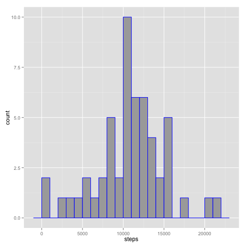
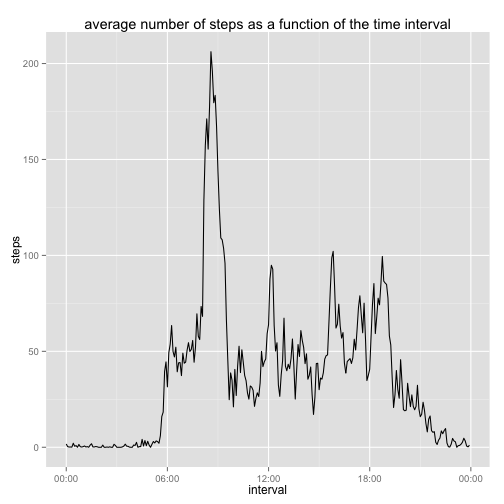
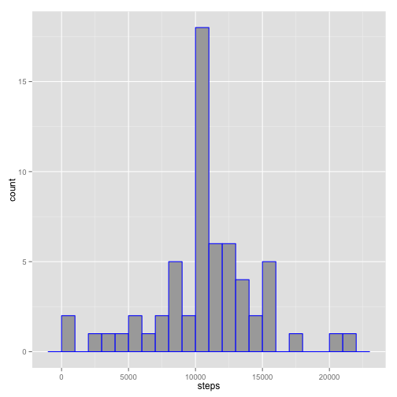
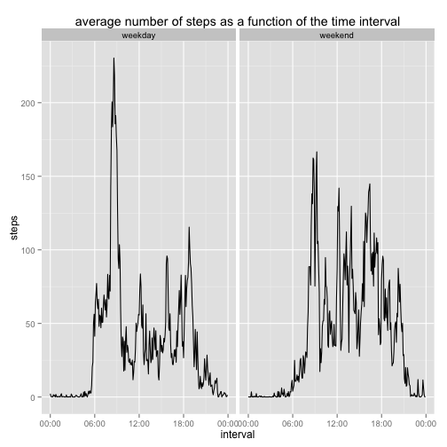

# Reproducible Research: Peer Assessment 1
## Karthik Palaniappan

This is my first experiment at literate statistical programming.  All thanks to 
Roger Peng.

Thanks also due to you, my evaluator!


## Loading and preprocessing the data
In this section, we will load the activity data into the system.  I'm also going
to experiment using the "cache=TRUE" option so that the code doesn't recompile
unnecessarily.


```r
stepsData <- read.csv("activity.csv", header=TRUE, na.strings="NA")
```

Merge the second and third columns to get the date in POSIXlt format


```r
stepsData$datetime <- paste(stepsData$date,formatC(stepsData$interval,digits=3,
                                                   flag="0"))
stepsData$datetime <- strptime(stepsData$datetime, "%Y-%m-%d %H%M")
```

Convert the original date and time columns to factors to enable manipulation by
date and time


```r
stepsData$date <- as.factor(stepsData$date)
stepsData$interval <- as.factor(stepsData$interval)
```

Find indices corresponding to non-NA values


```r
nonNAvalues <- complete.cases(stepsData$steps)
```

## What is mean total number of steps taken per day?

I want to learn how to use gg plot2 better, so I'm going to use that for the 
pictures.

First, let us segregate the number of steps by day, after accounting for non NA
values.


```r
nSteps <- tapply(stepsData$steps[nonNAvalues],stepsData$date[nonNAvalues],sum)
nSteps <- data.frame(date=as.Date(names(nSteps)),steps=nSteps)
```


Now, let's plot the number of steps per day as a histogram.


```r
library(ggplot2)
g <- ggplot(nSteps,aes(x=steps))
g + geom_histogram(binwidth=1000,color="blue",fill="dark grey")
```

 

We will use R's summary function to do this - because this gives us much
more information than just the mean and the median.


```r
summary(nSteps)
```

```
##       date                steps      
##  Min.   :2012-10-01   Min.   :   41  
##  1st Qu.:2012-10-16   1st Qu.: 8841  
##  Median :2012-10-31   Median :10765  
##  Mean   :2012-10-31   Mean   :10766  
##  3rd Qu.:2012-11-15   3rd Qu.:13294  
##  Max.   :2012-11-30   Max.   :21194  
##                       NA's   :8
```


## What is the average daily activity pattern?

get some sense of average steps per interval


```r
nStepsInterval <- tapply(stepsData$steps[nonNAvalues],stepsData$interval[nonNAvalues],mean)
nStepsInterval <- data.frame(interval=formatC(as.integer(names(nStepsInterval)),digits=3,flag="0"),
                             steps=nStepsInterval)
nStepsInterval$interval <- as.POSIXct(strptime(paste(nSteps$date[length(nSteps$date)],
                                          nStepsInterval$interval),
                                    "%Y-%m-%d %H%M"))
```

time series plot


```r
g2 <- ggplot(nStepsInterval,aes(x=interval,y=steps))
g2 + geom_line() +labs(title="average number of steps as a function of the time interval") +
        scale_x_datetime(labels=c("00:00","06:00","12:00","18:00","00:00"))
```

 

Find the interval that corresponds to the maximum number of steps

```r
maxLocation <- which.max(nStepsInterval$steps)
```

The maximum number of steps is taken at the interval

```r
nStepsInterval$interval[maxLocation[[1]]]
```

```
## [1] "2012-11-30 08:35:00 IST"
```

The maximum number of steps is given by:


```r
nStepsInterval$steps[maxLocation[[1]]]
```

```
##   835 
## 206.2
```


## Imputing missing values

Find the number of NA's in the original data set.


```r
sum(is.na(stepsData$steps))
```

```
## [1] 2304
```

Impute missing values by replacing NAs with the mean for that particular time 
interval as calculated previously and fill it in a new dataset


```r
filledStepsData <- stepsData
naValues <- is.na(filledStepsData$steps)
filledStepsData$steps[naValues] <- 
        nStepsInterval$steps[as.character(filledStepsData$interval[naValues])]
```

Make a histogram of the total number of steps taken per day


```r
nSteps2 <- tapply(filledStepsData$steps,filledStepsData$date,sum)
nSteps2 <- data.frame(date=as.Date(names(nSteps2)),steps=nSteps2)

library(ggplot2)
g3 <- ggplot(nSteps2,aes(x=steps))
g3 + geom_histogram(binwidth=1000,color="blue",fill="dark grey")
```

 

Report a summary of the data - showing the mean and median, among other things


```r
summary(nSteps2)
```

```
##       date                steps      
##  Min.   :2012-10-01   Min.   :   41  
##  1st Qu.:2012-10-16   1st Qu.: 9819  
##  Median :2012-10-31   Median :10766  
##  Mean   :2012-10-31   Mean   :10766  
##  3rd Qu.:2012-11-15   3rd Qu.:12811  
##  Max.   :2012-11-30   Max.   :21194
```

## Are there differences in activity patterns between weekdays and weekends?


classify days as weekday days and weekend days


```r
filledStepsData$isWeekend <- as.factor(
        weekdays(filledStepsData$datetime) %in% c("Saturday","Sunday"))
levels(filledStepsData$isWeekend)=c("weekday","weekend")
```


split the data as weekday data and weekend data


```r
separatedStepsData <- split(filledStepsData,filledStepsData$isWeekend)
```

get some sense of average steps per interval


```r
nStepsIntervalMWF <- tapply(separatedStepsData$weekday$steps,
                            separatedStepsData$weekday$interval,mean)

nStepsIntervalSS <- tapply(separatedStepsData$weekend$steps,
                           separatedStepsData$weekend$interval,mean)

nStepsIntervalFinal <- data.frame(interval=
                                          c(formatC(as.integer(names(nStepsIntervalMWF)),digits=3,flag="0"),
                                            formatC(as.integer(names(nStepsIntervalSS)),digits=3,flag="0")),
                                  steps=c(nStepsIntervalMWF,nStepsIntervalSS),
                                  weekday=rep(as.factor(c("weekday","weekend")),each=288))

nStepsIntervalFinal$interval <- as.POSIXct(strptime(paste(nSteps$date[length(nSteps$date)],
                                                     nStepsIntervalFinal$interval),
                                               "%Y-%m-%d %H%M"))
```


time series plot


```r
g4 <- ggplot(nStepsIntervalFinal,aes(x=interval,y=steps))
g4 + geom_line() +labs(title="average number of steps as a function of the time interval") +
        scale_x_datetime(labels=c("00:00","06:00","12:00","18:00","00:00"))+
        facet_wrap(~ weekday, nrow=1, ncol=2)
```

 
